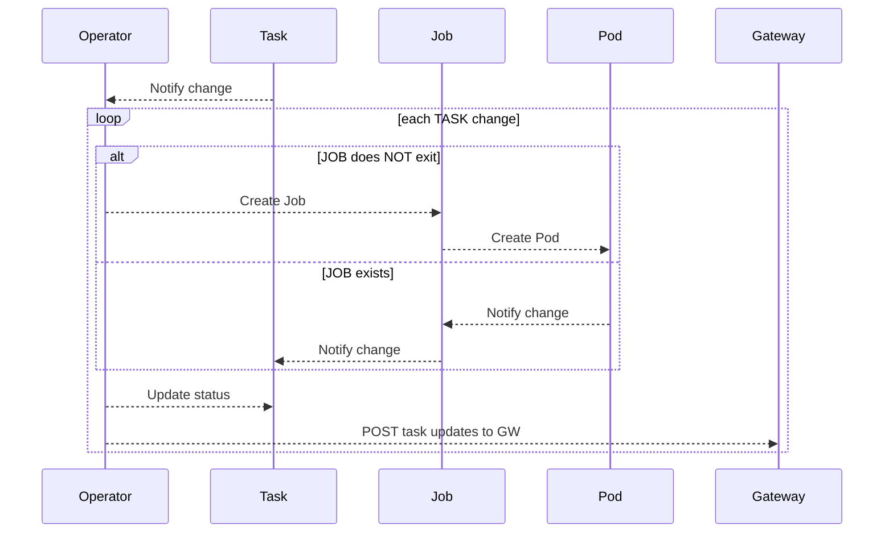
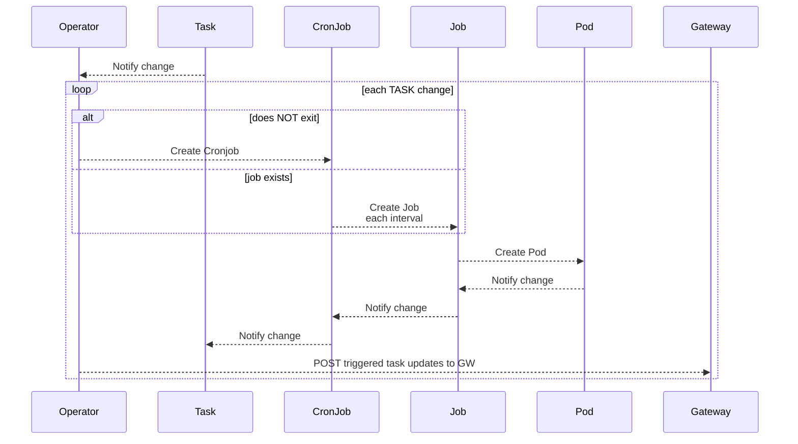
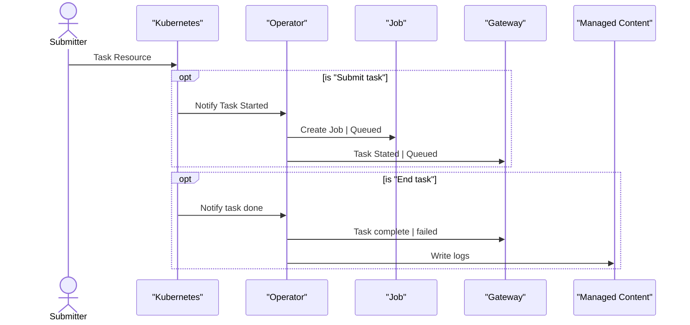

# Agent scheduling
Fabric users needs a mechanism to schedule agent and skill executions periodically.

The scheduling of tasks should use the native kubernetes cronjob. 

### Sequence diagrams

Tasks with schedule have a slightly different flow
1) The spawned tasks are not written to kuberentes, only to GW
2) The crons schedule is NOT written to Gateway


## Requirements

* No extra infrastructure for the scheduler
* Use existing concepts/resources in fabric 
* User should be able
  * List scheduled tasks
    * List should include an indicator for scheduled tasks
    * Longer history of tasks ( Not just `taskpool` N pods history )
    * List executions of a task
  * Determine success/failure of invoke
    * Include agent invoke status
  * Get execution logs
  * Cancel scheduled tasks
  * Describe the scheduled task
    * Get crontab => human readable UI/CLI output if possible
    * (TBD) show next and last execution 
* Concurrency flag on a skill to disallow tasks running concurrently. ( see k8s concurrency )
* Don't couple the operator to mongo/redis/blob store loosely couple to an optional microservice.
* task record should contain enough task detail to allow for task restarts
  * Store original task spec ?and? searchable fields

## Design

### Kubernetes Operator changes

The existing task resource can be modified to include a `crontab` string.

__TODO__ Should cronjob count against the task pool job limit ?

The operator will use the `crontab` string to create a kubernetes cronjob versus a simple kubernetes job.

__UNIT TEST:__ add unit test to  detect the correct resource type from task.

As adding cronjob will increase the number of job related pods the existing `taskpool`, the existing history mechanism will need to be changed
and a new service will need to be created to store task history, outside kubernetes resources.

Allow for existing task pool history behavior, so we can run the operator without another microservice.

For example a new  REST api `POST /internal/tasks/:taskid?status`  where the body are the logs __piped__ from the job's pod logs
As the logs can be large this process should be schedule goroutines within the operator, with a queuing mechanism to allow for higher loads and controlled RPS to the cortex microservice

__PERF TEST:__ Run a large number of job through the cluster, with 100meg-1gig log output and observe the operator & supporting microservice 

__TEST:__ Schedule jobs overlapping crontab interval  for example every 10 secs but job takes 30 secs to complete.  K8s job controller will fail existing jobs depending on concurrency setting.  

__UNIT TEST:__ Test post and retry, removal of completed/failed task from cluster ( for both scheduled and onetime tasks )

Questions
Do we "broadcast" pending -> queued -> started -> failed|complete to gw ?
  Or only initial & terminal states

Add new field to the existing task model ( copied from cronjob spec )
```
	//+kubebuilder:validation:MinLength=0
	// The schedule in Cron format, see https://en.wikipedia.org/wiki/Cron.
	Schedule string `json:"schedule"`

	//+kubebuilder:validation:Minimum=0
	// Optional deadline in seconds for starting the job if it misses scheduled
	// time for any reason.  Missed jobs executions will be counted as failed ones.
	// +optional
	StartingDeadlineSeconds *int64 `json:"startingDeadlineSeconds,omitempty"`

	// Specifies how to treat concurrent executions of a Job.
	// Valid values are:
	// - "Allow" (default): allows Jobs/CronJobs to run concurrently;
	// - "Forbid": forbids concurrent runs, skipping next run if previous run hasn't finished yet;
	// - "Replace": cancels currently running job and replaces it with a new one
	// +optional
	ConcurrencyPolicy ConcurrencyPolicy `json:"concurrencyPolicy,omitempty"`

	// This flag tells the controller to suspend subsequent scheduled executions, it does
	// not apply to already started executions.  Defaults to false.
	// +optional
	Suspend *bool `json:"suspend,omitempty"`
```

### Gateway changes

Add a new task type to the mongo database

Change `corex/jobs` runtime to write a PENDING task record when first submitting a job.
- determine if we can get queued status from the operator
- should the operator  update the state from submitted -> queued -> active, could be expensive ??

Change task/list to
- Get SUBMITTED/COMPLETED/FAILED tasks from mongo

Add query/filter to task listing 
- filter by type cron/onetime
- filter by task

__TODO__ perhaps use GRPC instead of rest ?

Add REST api(s) to create/update tasks including:
- task details
  - task name
  - start
  - end
  - projectId
  - status (renamed from `state`)
  - activationId
  - skillName
  - actionName
  - user ( submitter )
  - source (gateway|api service)
  - payload (TDB)
  - schedule
  - taskPool
  - statusReason
- log data -> managed content `/tasks/<taskname>-<start epoch minutes>/log.txt`  ( this naming convention matches k8s's cronjob -> job naming convention)   
- (TBD) other artifacts `/tasks/<taskname>-<start epoch minutes>/<artifact>`

### Managed content changes

Add TTL to managed content to auto clean log data from blob store ( if supported on the provider )

Kubernetes job name end with epoch in minutes following kubernetes' convention.



# TODOS
- Operator changes
  - [x] call task api for new tasks
  - [x] call task api for complete|failed tasks
  - [x] create cronjob when schedule is present
  - [x] improve unit tests, tests use pod status for simulating completing/failing tasks
- GW modify task REST api
  - [X] Add task collection to mongo
  - [X] Add new REST api to update task by name
  - [X] LIST to use mongo
  - [X] LIST add channelId/refId to list filters
  - [X] GET to use mongo
  - [X] feature flag to support OLD behavior (features.persist_tasks)
  - [x] logs api to use Managed content for done and k8s logs for active tasks
  - [x] Activations add channelId (from) + messageId to transits
  - [x] POST api to pause scheduled (PATCH)
  - [x] POST api to resume scheduled tasks, skill callbacks (PATCH)
  - [x] Add agents rest api to schedule agents
- GW V2 logs apis
  - [X] Operator writes logs to managed content
  - [X] download raw file
- Cortex cli
  - [x] tasks list db format
  - [x] tasks get db format
  - [x] task delete/cancel
  - [x] task list scheduled tasks
  - [x] task resume
  - [x] task pause

# TODO drop 2
- [] GW V2 logs apis
  - [] return array of rows NOT raw text
  - [] tail logs scroll backward
    - [] limit/offset
  - [] filter with before/after lines
  - [] sort oldest/newest
  - [] add/emit server timestamps
- [] Refactor server **TBD**
  - [] run tasks apis in own thread
    - [] use GRPC
  - [] run kafka in own thread
  - [] run agent/skill watched in own thread
    - [] perhaps use GRPC pub/sub for agents/skills ?
- [] Connections
  - [] content expiration ( auto delete after N days )
- [] Operator
  - [] delete task after logs & tasks successfully written to mongo/log store (TDB)
- [] Cortex cli
  - [] task logs follow/live (TBD) 

## Usage

---

### Scheduling an agent

1) Create skills/agents and deploy to the cluster
2) Invoke the agent with `--scheduleCron <cron>` and optionally `--scheduleName <name>`
```
cortex agents invoke  hubble_agent input --params '{"payload":{"text":"test cron"}}' --scheduleCron "* * * * *"
cortex agents invoke  hubble_agent input --params '{"payload":{"text":"test cron"}}' --scheduleCron "@hourly" --schduleName "hubble_hourly"
```

This will:
* Create a cronjob using a new `sys-invoke-skill` skill that is managed by fabric internally. The Gateway service will auto deploy the skill to the user's selected project and update the deployed skill as needed. If a new skill version or image is detected
* Create a task named `--scheduleName`, that manages a cronjob on the k8s cluster.
* Use the existing cortex-process-gateway image to invoke agents using a job/task, uses gateway service image.  Executes `/dist/sys-invoke-skill.ts`

__NOTE:__ Schedule name get clobbered, prefixed with project and '_' => '-' following k8s conventions.

---

### Managing scheduled tasks

1) To see what schedules exist

  ```
   $ cortex tasks list --scheduled                                                                   
  ┌────────────────────────────────────────┬──────────────────────────────┬──────────────────────────────┬────────────────────┬─────────────────────────┬────────────┐
  │ Name                                   │ Skill Name                   │ Action Name                  │ Status             │ Started                 │ Schedule   │
  ├────────────────────────────────────────┼──────────────────────────────┼──────────────────────────────┼────────────────────┼─────────────────────────┼────────────┤
  │ proj1-hubble-hourly                    │ sys-invoke-skill             │ invoke                       │ Active             │ a few seconds ago       │ @hourly    │
  ├────────────────────────────────────────┼──────────────────────────────┼──────────────────────────────┼────────────────────┼─────────────────────────┼────────────┤
  │ proj1-hubble-yearly                    │ sys-invoke-skill             │ invoke                       │ Active             │ a few seconds ago       │ @yearly    │
  └────────────────────────────────────────┴──────────────────────────────┴──────────────────────────────┴────────────────────┴─────────────────────────┴────────────┘
  ```

2) Pausing a schedule

  ```
   $ cortex tasks pauseSchedule proj1-hubble-hourly
  {"success":true,"message":"Successfully paused task \"proj1-hubble-hourly\""}
  ```

  Use the list command to see what schedules are `PAUSED`
  ```
   $ cortex tasks list --scheduled      
  ┌────────────────────────────────────────┬──────────────────────────────┬──────────────────────────────┬────────────────────┬─────────────────────────┬────────────┐
  │ Name                                   │ Skill Name                   │ Action Name                  │ Status             │ Started                 │ Schedule   │
  ├────────────────────────────────────────┼──────────────────────────────┼──────────────────────────────┼────────────────────┼─────────────────────────┼────────────┤
  │ proj1-hubble-hourly                    │ sys-invoke-skill             │ invoke                       │ PAUSED             │ 3 hours ago             │ @hourly │
  └────────────────────────────────────────┴──────────────────────────────┴──────────────────────────────┴────────────────────┴─────────────────────────┴────────────┘
  
  ```

3) Resuming a schedule
  ```
   $ cortex tasks resumeSchedule proj1-hubble-hourly
  {"success":true,"message":"Successfully resumed task \"proj1-hubble-hourly\""}
  ```

4) Deleting a schedule
  ```
   $ cortex tasks delete proj1-hubble-hourly
  {"success":true,"message":"Successfully marked task proj1-hubble-hourly for delete"}
  ```

__Note:__ There is no history of task schedules, there is a history of the jobs it spawns.

---

### Checking task executions/agent invokes

Checking tasks
```
cortex tasks list 
```
__TODO__ Need to list by agent or scheduleName

Checking agent executions from a given schedule
```
cortex agents list-activations --correlationId proj1-hubble-hourly
```


