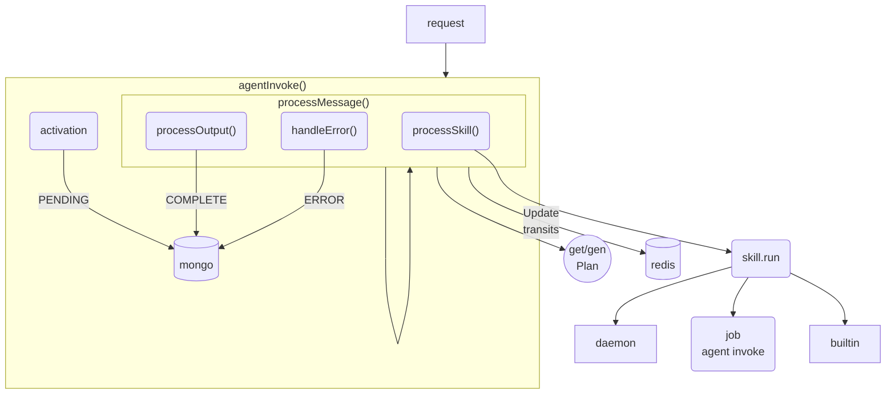

# **Agent/Skill Execution**

Processor Gateway and Operator

---

# Processor Gateway(PG): Purpose

* Executes agents dag and invoke skills
* Get/Set sessions data
* Lists/Get `activations`
* Internal apis for job/agent callbacks

---

# PG: Design

* Unless job/agent is called all processing happens within a single PG instance
* If a job/agent is called the next steps may be handled by another instance
* There is NO queueing within PG, we can expect consistent execution performance
* PG should only require redis/mongo/k8s to function (*secrets)

---

# PG: Invokes

---
# Operator: Purpose

* Deploy skills and their actions
* Manage Jobs
  * Execute jobs/tasks
  * Limit active tasks via taskpool(s)
  * Invoke job callbacks
* Define schema for custom resources
  * task, skill, agent, taskpool

---

# Operator: Reconcile skills

1) generate resource

2) get resource from cluster

3) create if not found -> requeue for status

4) compare new old resource

5) patch if different -> requeue for status

6) update status

---
# Operator: Skills recent changes

* Support more resource types
  * Add interface to make code more maintainable
  * Support structured and unstructured resources
* Use annotations to 3way compare
* Turn log level down

---

# Operator: Reconcile task

1) check taskpool requeue `N` secs later if out of slots

2) generate k8s job

3) create k8s job if missing -> status = active

4) check job status
   * status = Completed | Failed
   * get last N chars logs
   * if callbackUrl call back
   * return slot taskpool

---

# Operator: Task recent changes

* Limit length of logs to last N chars

---
# Operator: Maintenance

* Update `k8s.io/api` to reflect k8s version
  `v0.22.2` is compatible with <= `1.22.2`

* Update operator-sdk 
   * Generate a new operator and compare output
   * Check go compiler version
   * Check `go.mod`
   * Spot check code..
