# Gateway design notes

## State transition for agent activation and skill transits

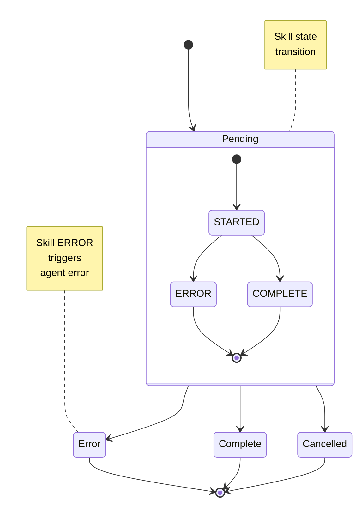

## Basic GW behavior

- By default, all agent/skill invokes are asynchronous, the caller gets an activationId that will be completed in the future
- Internally daemons/rest calls are executed synchronously, GW waits for rest call to complete before the next step
  - The results can be retrieved synchronously via REST using the ?sync flag
- Job and Agent invokes are asynchronous, the job/agent notify GW to continue process via internal callbacks

* If any of the agent's skills daemons return non-2xx response or jobs return non-zero exit code
  * output includes and `error` property from failed skill
  * The activation should be marked as ERROR
  * Downstream skills will not execute
  * Concurrent skills keep processing but do not execute next steps
  * send_message() DOES NOT stop execution each message is an independent "thread"
    * 100% error output is allowed, __How do I cancel execution/stop upon threshold?__

* ALL input, skills, output can have mappings
* Payload is passed between each skill
  * send_message() required for job chaining..
  * JOB payload is limited to 4096 chars ( unix limit.. )

* Properties are resolved from Agent definition, Skill definition, Skill references in agent
  * Secret for secure properties are resolved
    * Agent should ERROR if secret unresolved

* Agent invoke should ERROR if:
  * Agent definition not deployed to cluster
  * Agent input not mapped
  * skill output not mapped from skill to either a skill or output
  * Agent contains a loop
  * Skill definition missing/not deployed
  * Skill not ready

* Agent cancel behavior:
  * Any pending activation can be cancelled
    * Inflight JOBs will be cancelled (unless user chooses to let them complete via a query parameter)
  * ERROR|CANCELLED|COMPLETED activations should NOT have their status changed
  * Missing activation should throw a 404
  * If a cancellation fails the status should remain pending, the user should be able to resubmit a cancellation.
  
**KNOWN ISSUES** agent properties passed into invoke aren't passed to skills

## Send message behavior

- The agent will not fail/error unless the job submitting messages fails ( for multiple messages )
- Each message will create transits for the skills it triggers
- Each message will have a messageId that is the channelId:{Message count}
- The agent design must mark the output as merge to merge results otherwise ONLY the first response is reported
- It is recommended to use `stats` for the agent output if many messages are sent

## Catch finally skills
### Behavior

- `finally`/`catch` skills are optional
- Catch/Finally skill can ONLY be daemons, jobs are not supported (as of 07/2022)
- Always execute `catch` skill upon for any error, unless `catch` skill ref/definition has missing action or service/input.
- Always execute `finally` skill success or failure, unless `finally` ref/definition has missing action or service/input.
- Only execute the `catch` and `finally` skills once.
- Always execute `catch` before `finally`
- Each agent service/input has a different set of `catch` or `finally` blocks
- And agent MUST have at least one mapping, GW won't execute just `catch` or `finally` in an agent
- All skills should have completed execution before executing `finally`
- Skill invokes will not support `catch`/`finally`, only works with daemons
- The response to be returned MUST be returned from the `finally` skill
- The `catch` skill must return an `error` response, the `catch` skill receives { error: "error message" }
  - If either the catch/finally skills fail the entire agent is marked ERROR
- If `catch` skill fails the `finally` skill WILL NOT be called.

## Callbacks

- If `callbackUrl` is defined invoke request GW will POST { response, status } to the provided url
  - Callback failure will NOT impact activation status, only an ERROR log message will be generated.
- This is used internally for JOBs/Tasks as well..

## Agent validation/plans

- Plan generation has been added to the agent invoke REST api which checks the following:
  - The agent exists
  - The skills referenced in the agent exist (for the given agent input)
    - The actions referenced in the skill exist ( and are all async capable )
  - There are no cycles
  - All skill outputs are:
    - are mapped to another skill/output
  - Marks the agent + input as sync/async capable
    - Partially defined skills having: missing actions, routes, inputs will be assumed to be async
    - Job, Agent invokes are async
- If `sync=true` is provided as a query parameter
  - all skills are checked to ensure they are sync compatible, otherwise the invoke will fail.
    - Currently only daemons and javascript skills are supported.
  - `reponse` is included in the response
- An activation record is still created and should contain the same attributes as an async request

# Agent skill routing examples

## Simple linear chain ( daemon or job)

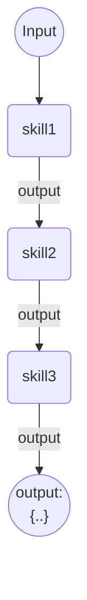

* **Success** all three skills execute once

**Example:**

* cortex-local/fixtures/helloDaemon/agent-chain.json (daemons)
  * output `Got: Got: Got {text}`
* cortex-local/fixtures/helloDaemon/agent-chain-fail.json (daemons)

* cortex-local/fixtures/jobAgents  (job chaining agent)
  * agent-jobchain.json
  * agent-jobchain-error.json (second job fails)

## Simple branch ( daemon or job)

### V1 two skills

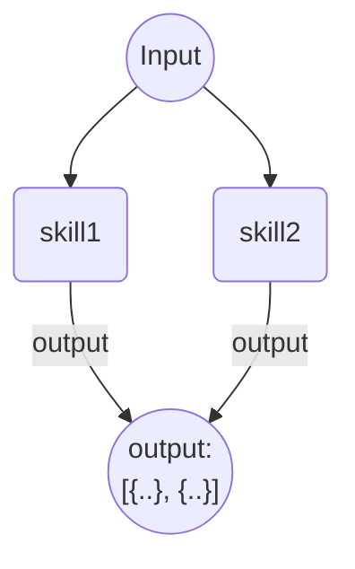

* **Success** ALL skills execute once

#### Examples

* cortex-local/fixtures/helloDaemon/agent-branch.json (daemons)
  * output.mode=single => one agent output
* cortex-local/fixtures/helloDaemon/agent-branch-merge.json (daemons)
  * output.mode=merge => list two outputs
    **Check activation results^^**

* cortex-local/fixtures/helloDaemon/agent-branch-fail.json (daemons)
  Execute both skills, one fails **Might COMPLETE or FAIL depending on first response**

* cortex-local/fixtures/helloDaemon/agent-branch-fail-merge.json (daemons)
  Execute both skills, one fails **Always fails**
  **Known Issue** Agent events do NOT match activation for merge output

### V2 four skills NO output routing

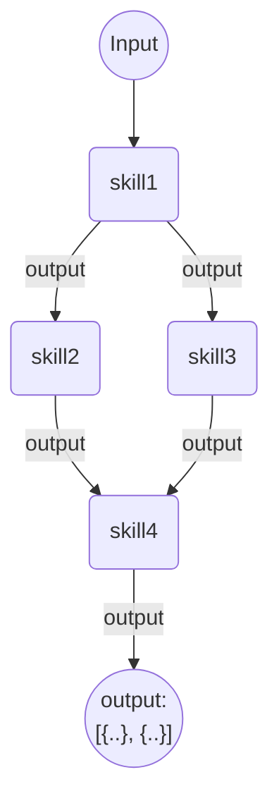


* the outputnames are all the same there is no routing on outputname
* **Success** skill 1,2,3 execute once and skill4 executes **twice**, output contains FIRST response

#### Example

* cortex-local/fixtures/daemon-diamond-merge/agent-lollipop.json
  * First output wins...
* cortex-local/fixtures/daemon-diamond-merge/agent-lollipop-merge.json
  * expect array output

NOTE: uses javascript skills require scripted skills to be enabled


### V4 four skills routing by name

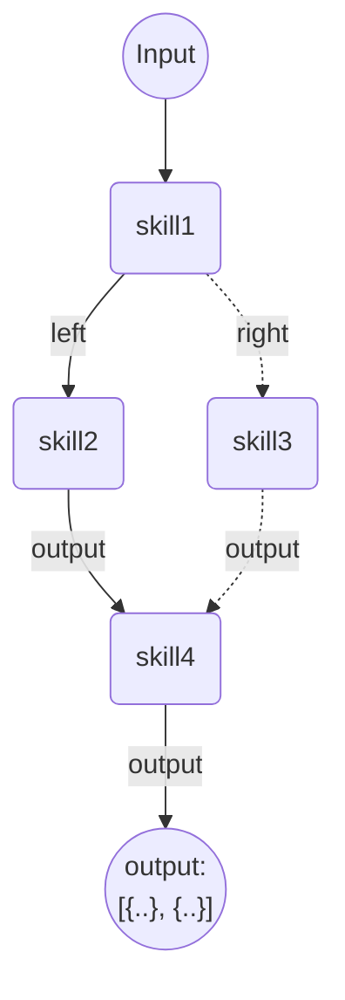

* skill1 has outputnames: left and right
* **Success** skill 1,2,4 execute once and skill 3 is **NOT** executed

#### Example

* cortex-local/fixtures/abexample

### Short circuit

Multiple outputs, one output continues the other connects to the output

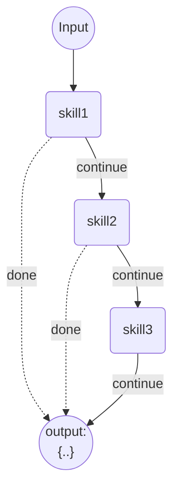

* skill 1&2 route done if a condition isn't met
  * skill 1 or 2 can emit 'done' or 'continue'
  * if done is called other "downstream" skill are NOT invoked, and the agent is COMPLETE
  * if the condition are met all skills are executed

#### Example

* cortex-local/fixtures/abexample/agent.json
  Invoke the agent with {"payload" : { "number": 0}}  number <=0  with call `quit` output and goto output directly

### Agent invoking agent

The invoke'd agent is passed a callback the notifies the caller it completed execution
The activationId of the caller is passed to the callee as the corrolationId for traceability.


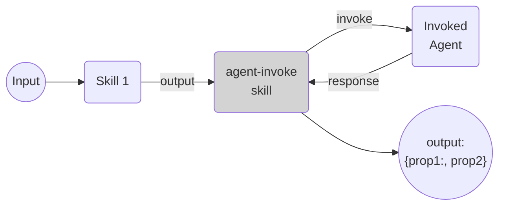
_*light grey: system skill*_

* `agent-invoke` is a system sill that allows an agent to invoke another agent
* **Success** skill 1,2 and "Other Agent" invoked once.
  * Output from "Other Agent"

#### Example

* cortex-local/fixtures/agent-invoke/agent.json - invoke one agent
* cortex-local/fixtures/agent-invoke/agent-invoke-chain.json
  use `failRegex` property on helloDaemon skill to test failures.

### Agent merges output

The agent below calls `skill4` twice, og the agent's output has `mode=merge` the response will be an array.
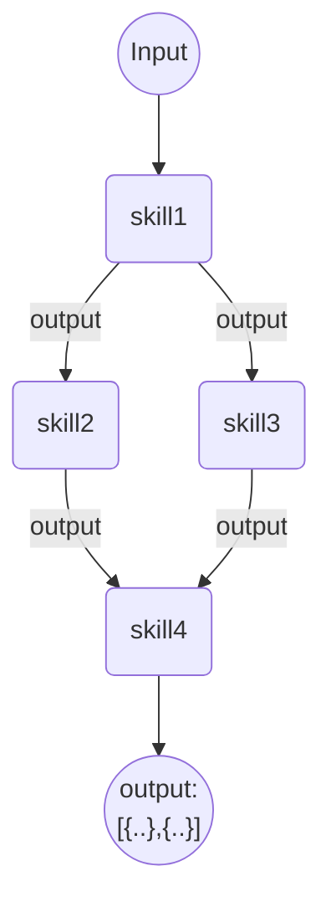

The `merge` skill merges upstream skill outputs and sends a single message to subsequent skills/outputs
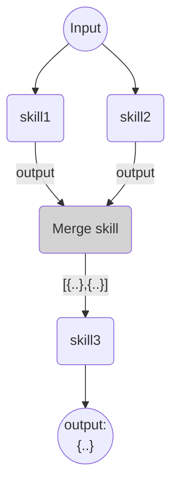
_*light grey: system skill*_

If the agent's output has `mode=merge` the output of skill4 and skill5 are merged 

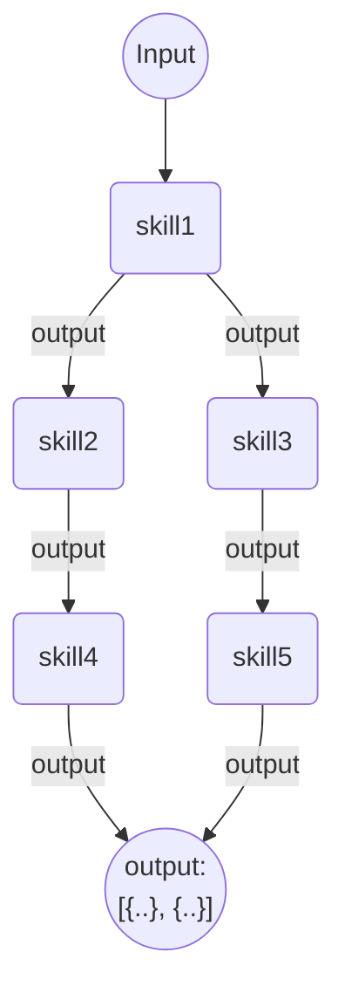

* the outputnames are all the same there is no routing on outputname
* **Success** skill 1,2,3 execute once and skill4 executes **twice**, output contains BOTH responses
  * Gateway merges the responses into an array `{ response: [{..},{..}] }`

#### Example

Any of the fixtures with output.mode = 'merge'

* helloDaemon/agent-branch-merge.json
* daemon-diamond-merge/agent.json
* daemon-diamond-merge/agent-lollipop-merge.json

### Job invoke multiple skills (Mission agent)

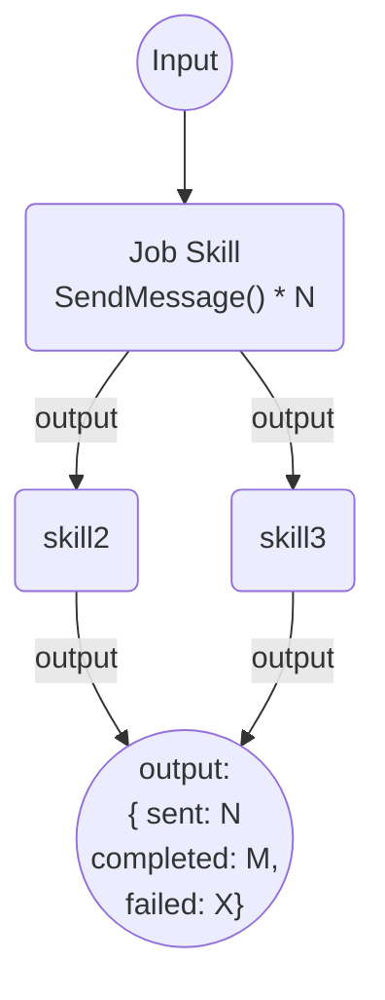

* job send synapse message(s) for each record the job locates for example an AMP cohort
  * the job can optionally can route the message to a specific outputNames for example interventions
* **Success** the job processes N records and invokes to skill2 + skill3 == N
  * the output must change
    * don't want N outputs in an array
    * don't want 1000s or sub elements in an activation
    * do want to track outputs (TBD)

Agent `output.mode`:
- single object - first response current behavior
- merge - collect all responses and return array of
- stats - connect metrics on execution but not output as there may be too many

####TODO

* Missing max error count and job cancellation..
* Missing retries/resubmit

#### Example

* cortex-local/fixtures/send-message-example/agent.json - sends 10 messages to downstream skill
  output.mode='stats' output.mode='merge' need to be tested

## Deal with skill no-ops

**This is not SUPPORTED ATM**
Unmapped skills will NOT execute and will throw an error

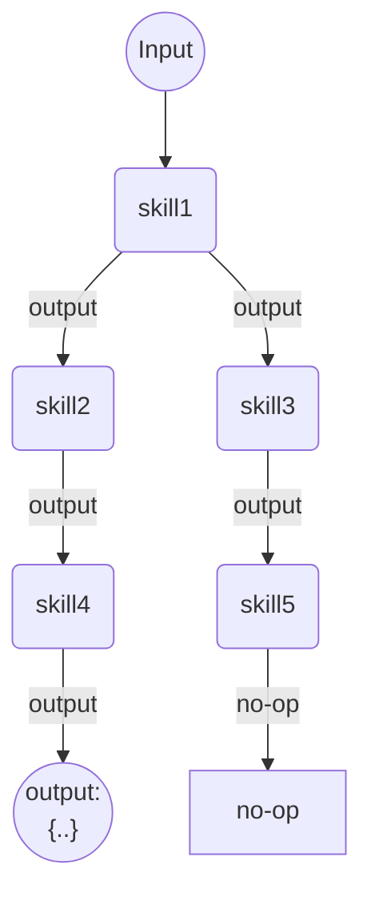

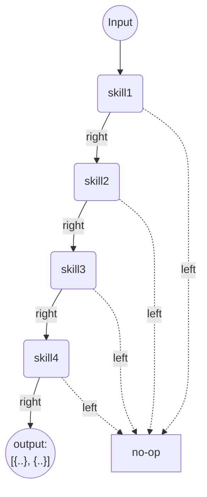
* **Success** all skills invoked once
  * OR `DO NOTHING` mark agent COMPLETE
  * After doing nothing, no other skill should be invoked
* if route is NOT `no-op` then error if "dangling" skill output

### Skill merges skill outputs

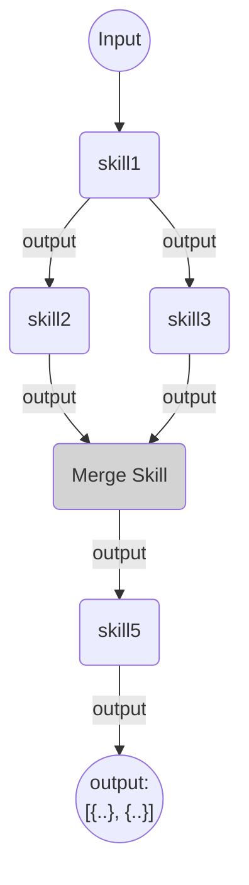

#### Example

* cortex-local/fixtures/merge-test/agent.json

#### TODO

* Add failure tests

* Support `no-op` or `do-nothing` outputs on skills
Allow skills with specific outputName to NOT b mapped
Otherwise the system should throw an error for dangling outputs
( How to we allow developer to noop a skill output ( not named `no-op`))
Do we ALSO have a no-op output ??

# Gateway connector/workers

## Runtime topology

Processor gateway consists of a main server process that:
- Handles express api requests
- Manages health
- Exposes metrics
- Starts a pool of Agent worker(s)
- Starts connector worker(s)

**NOTE:** The Main and Agents workers all require connections to: redis, mongo, and k8s.

Worker communicate via IPC/Shared memory, so this involves serialization/deserialization overhead.

The worker pools have a queue limit allowing the GW instance to provide backpressure to clients e.g. 429 too many requests to clients to allow for load balancing  
https://github.com/piscinajs/piscina#backpressure

Each worker consumes ~256 MB of ram, so the runtime footprint of GW is:
( 256 MB main + 4 * 256 MB agent workers + 256 MB connector worker) or 1.5 GB of RAM

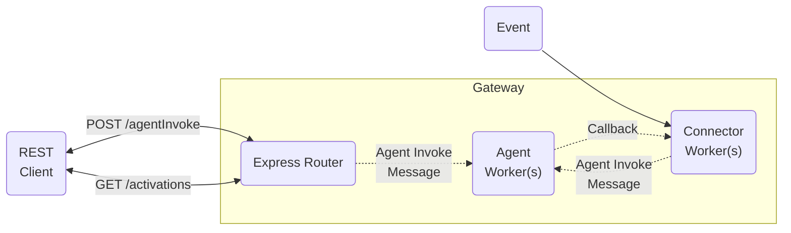

**Note:** Express router and "Agent worker" both connect to redis/mongo

**Note:** Workers have a queue to Limit in process work "piscina". Have worker count * parallelism

**Note:** Worker notifies the worker of completion via a "connector://" callback that the connector class registers

# Integrating client applications with Fabric

## HTTP requests and polling for completion
This is most commonly used way to invoke agents/skills.  
The http request returns an `activtaionId` in the response immediately.
The caller must the check the activation later to see when the agents/skill
activation is complete.

While this is the simplest method to invoke agents/skills.
This is not an optimal method for integrating with fabric as this adds lots of
extra requests while the user is polling
for agent/skill completion.

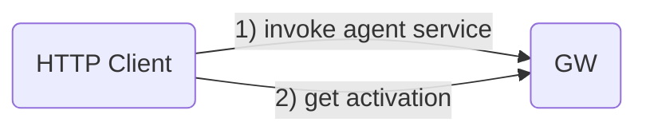

## HTTP request and callbacks
This approach requires the addition of a `callbackUrl` to the invoke request's properties, this allows processor gateway to notify the caller that the agent invoke is `COMPLETE | ERROR`.

This is far more efficient than polling for completion, but does require bidirectional communication with the client application.

The callback is always a POST with a JSON body containing { response: {}, status: COMPLETE|ERROR }
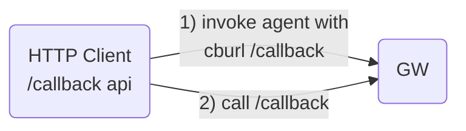

## Kafka

Adding kafka or some other message broker to the deployment has several advantages.
1) resilience
    1) if a service goes down GW can continue after the problem is resolved
    2) if there are sudden increases in workload these can be buffered in the broker
2) scaling - GW instance can be added dynamically to deal with increase load.
3) GW can submit requests for reprocessing

A disadvantage is Kafka can be difficult to deploy and manage, as it not a small piece of infrastructure.

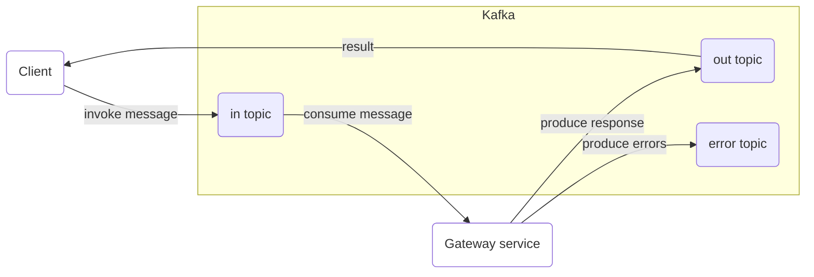

The message format for Kafka is assumed to be CloudEvents.
If an alternative message format is used an adapter must be provided to convert the request into a consumable format.

Assuming connector can only listen to one in/out topics pair
If we want more topics we deploy more connector instances...

### Deployment Types (TBD)

#### Handle requests for all agents
This is currently all that is supported. All messages got through the same topics and can call ANY agent deployed to fabric in any project.

#### Handle request for only one agent
< Future work >

#### Handle multiple topics
Topic per agent __TDB??__

#### Examples
- Handle resubmissions "retryable errors"
- Example client emulating synchronous requests.
## Websockets
This is exposing the mechanism that cortex console/agent composer used to communicate with agents.

We'd need an enhancement to make the websocket connection less chatty, that is to remove the skill level events and only provide the `agent.output` event.
### Implementation

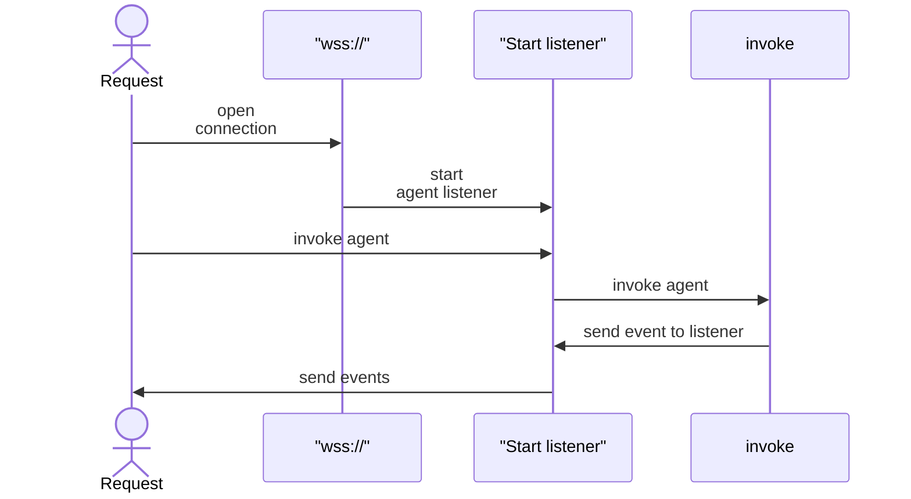

## GRPC (TDB)

Uses HTTP/2 protocol streams
https://grpc.io/docs/what-is-grpc/core-concepts/#bidirectional-streaming-rpc

## Cloud events (TDB)

```json
{
  "source": "<requester>",
  "id": "<unique id generated by client>",
  "type": "c12e.fabric.agentInvoke",
  "dataContentType": "application/json",
  "<custom  att1>": "<some value>", 
  "data": {
    "projectId": "projectId",
    "agentName": "<agent name>",
    "input": "input name",
    "payload": {},
    "properties": {}
  }
}
```

Authentication is handled by the broker.
Http requests can use `Authorizarion: bearer <JWT>`
Kafka connector authentication requests per connection.


# Running unit tests against minikube
Removing the following config var in `test.json` (or setting it to anything other than `test`) will allow the tests to run against whatever `kubeconfig`/context is currently configured, this allows for testing against a live k8s api (like minikube)

```json
{
  "kubernetes": {
    "config": "test"
  }
}
```

## Test environment setup

Setup istio + kiali
  - Ensure kiali and prometheus are working
    `istioctl dashboard kiali`

If not installed, install kiali and promethius using istio docs
  ```
  kubectl apply -f https://raw.githubusercontent.com/istio/istio/release-1.19/samples/addons/grafana.yaml
  kubectl apply -f https://raw.githubusercontent.com/istio/istio/release-1.19/samples/addons/prometheus.yaml
  kubectl apply -f https://raw.githubusercontent.com/istio/istio/release-1.19/samples/addons/kiali.yaml
  ```
  **Note:** If not using the preconfigure promethius and grafana follow the instuctions on `Option 2` for each service here: https://istio.io/latest/docs/ops/integrations/

Verify the metric server is running and pod level stats are being collected
      `kubectl get pods -n kube-system -l k8s-app=metrics-server`
    If no pod found check with the vendor documentation for installing the metrics-server
      `minikube addons enable metrics-server`

